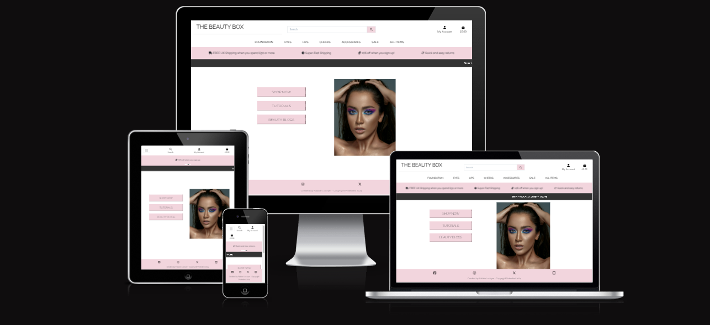
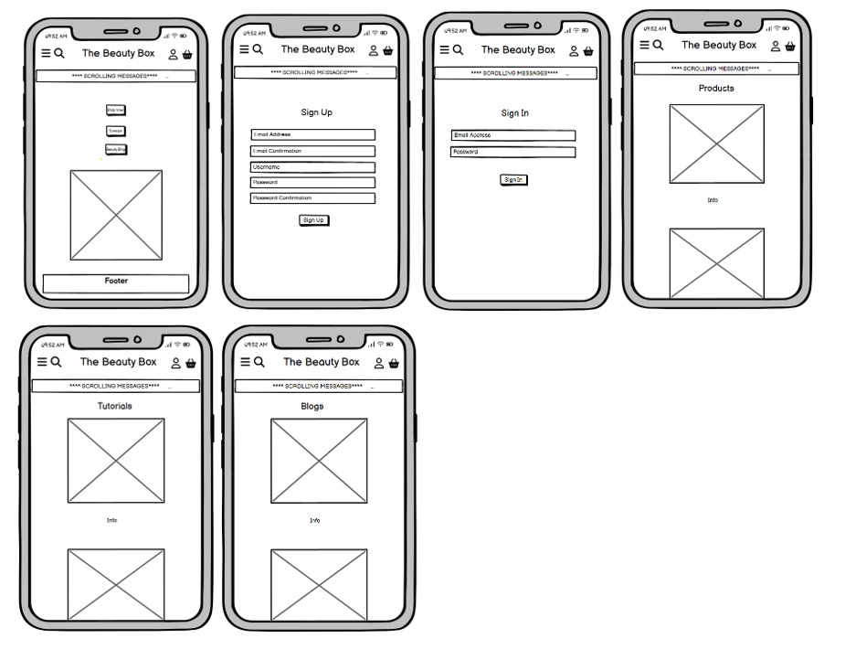
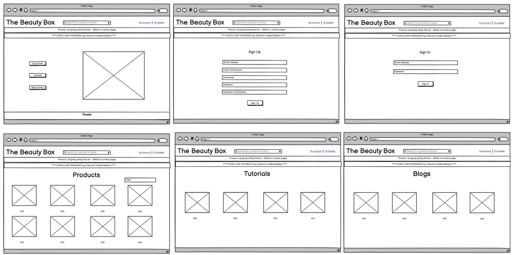
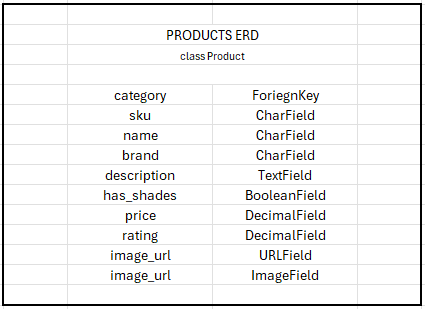
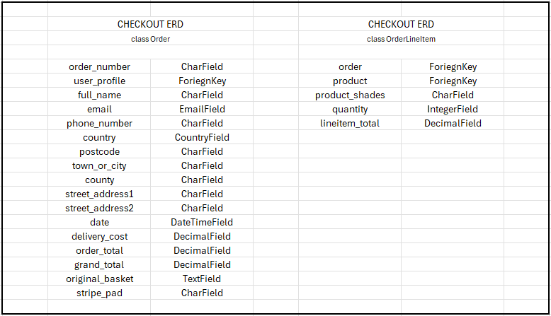
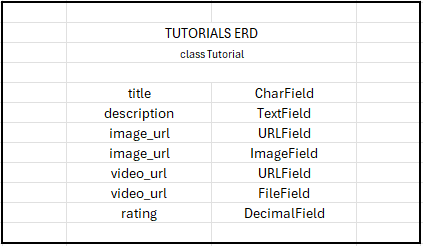
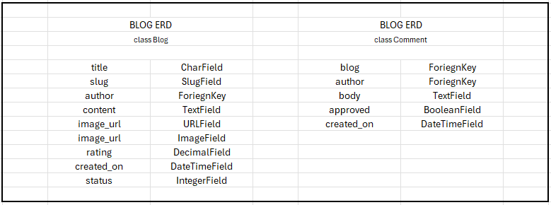
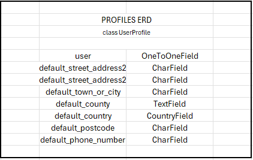
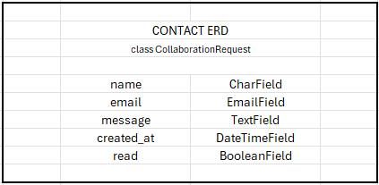
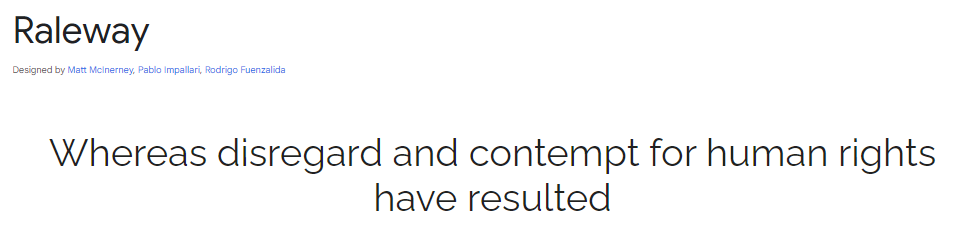

# [The Beauty Box](https://the-beauty-box-9dcfa44a254a.herokuapp.com/)

A fictional E-commerce Beauty Store using Django and Stripe, developed by Natalie Lockyer.

***

[Please click here to view my live website](https://the-beauty-box-9dcfa44a254a.herokuapp.com/)

# Contents
+ [Purpose of the Project](#purpose-of-the-project)
    + [Checkout Details](#checkout-details)
+ [User Experience](#user-experience)
    + [Key Project Goals](#key-project-goals)
    + [Target Audience](#target-audience)
    + [User Requirements and Expectations](#user-requirements-and-expectations)
    + [User Stories](#user-stories)
+ [Website Information](#website-information)
    + [Website Menus](#website-menus)
    + [Wireframes](#wireframes)
      + [Mobile Wireframes](#mobile-wireframes)
      + [Desktop Wireframes](#desktop-wireframes)
    + [Entity Relationship Diagram (ERD)](#entity-relationship-diagrams-erd)
      + [Product ERD](#product-erd)
      + [Checkout ERD](#checkout-erd)
      + [Tutorials ERD](#tutorial-erd)
      + [Blogs ERD](#blog-erd)
      + [Profile ERD](#profile-erd)
      + [Contact ERD](#contact-erd)
    + [Design](#design)
      + [Typography ](#typography)
    + [Features](#features)
      + [Main Homepage](#)
      + [Products Page](#)
      + [Product Detail Page](#)
      + [Basket Page](#)
      + [Checkout Page](#)
      + [Tutorial Page](#)
      + [Tutorial Detail Page](#)
      + [Blog Page](#)
      + [Blog Detail Page](#)
      + [Sign Up Page](#)
      + [Login Page](#)
      + [Profile Page](#)
      + [Help Page](#)
      + [Contact Page](#)
      + [Error Page](#)

+ [Future Features](#future-features)
+ [Technologies Used](#technologies-used)
    + [Languages Used](#language)
    + [Frameworks Used](#frameworks-and-tools)
+ [Testing](#testing)
  + [Code Validation](#code-validation)
  + [Full Testing](#full-testing)
  + [Fixed Bugs](#fixed-bugs)
  + [Supported Browsers](#supported-browsers)
  + [Deployment and Local Deployment](#deployment-and-local-deployment)
  + [Deployment](#deployment)
  + [Local Deployment](#local-deployment)
  + [How to Clone](#how-to-clone)
+ [Credits](#credits)
+ [Acknowledgement](#acknowledgements)

***
***

# Purpose of the Project
The Beauty Box is a ficticious E-Commerce website that sells beauty products and accessories. The website also has make-up tutorial videos and make-up blogs. 
The website has been designed to give the user a great experience, from an attractive and eyecatching website, to filtering our products to see the newly listed items, tips and tricks in our make-up tutorials and blogs containing up to date and intresting information.  

This full stack frame work has been built using the Django framework. 

The Beauty Box, provides its users with 
* A registration page, which will give the user a profile page once complete. The profile page will allow the user to  update their contact/delivery and payment details and also see their previous orders (if any).
* A product page, detailing all our items we have for sale, which can be filtered into many different categories.
* A checkout page, listing the items in their basket and a secure checkout.
* A tutorial page were users can get the latest tips and tricks and instructions on how to apply their make-up.
* A blog page, again with all the lastest tips and tricks, and the most up to date and interesting information.
* A contact page, where users can get in touch, join our mailing list or ask questions.
* A help page, where users can see our returns policy, delivery costs and our privacy policy.

For Superusers it provides all of the above and in addition -
* A Product management page, where the superuser can add new products directly on the webpage, edit, update and delete products.
* A Tutorial management page, where the superuser can add new tutorials directly on the webpage, edit, update and delete them.
* A Blog management page, where the superuser can add new blogs directly on the webpage, edit, update and delete them.

### Checkout Details

In order to make an example purchase a specific card number is required:
|Card Number|Date|CVC|Postal Code|
|---|---|---|---|
|4242 4242 4242 4242|any date|any 3 numbers|any 5 numbers|

# User Experience

### Key Project Goals

* To write and develop an E-commerce website that is an eyecatching, informative, interactive, and enjoyable website that users will want to return to.
* The user will be able to navigate around the website with ease, either on a mobile or desktop device. 
* The main homepage is clear as to what the website is about and have accessible menus taking the user to the different pages of the website. 
* Users that register for a Beauty Box account will be able to see their own profile, which will have up to date contact/delivery and payment details. Users will also be able to see their order history (if any). 
* Users will be able to see a products page that lists all the items that Beauty Box has for sale. Users will be able to filter the items into categories of their choosing.
* Users will be able to add products to a basket, go to checkout and pay for the items through a secure checkout.
* Users can view make up tutorials via video and a text column
* Users can view blog posts which provide intereting and up to date information, users can add comments, edit them and delete them. 
* Users can get in touch with our team if required via a contact page.
* Users can see returns policy, delivery information a site policy. 

### Target Audience

* Anyone over the age of 12, that wears or has an interest in make-up.
* Anyone who is looking for gift ideas or want to make a purchase for themselves. 
* Users that want to learn how to apply make up via an online tutorial.
* Users who like to keep up to date with the latest tips and tricks blogs. 

### User Requirements and Expectations 

* An accessable website, that is clear and easy to navigate and understand.
* The ability to register for a Beauty Box account
* The ability to view products, and view them in more detail, before they add them to their basket.
* The ability to filter products into categories.
* The ability to take the products to a checkout and pay for the products securely. 
* The ability to view, add, edit & delete any comments they have made.
* The ability to get in touch.
* The ability to see the return policy, delievery information and the sites privacy policy. 

### User Stories

As a site user:

* I am able to view a list of products
* I am able to view individual products, which contain an image, description, price, shades, quantity and an add to basket button if I wish. 
* I want to be able to identify any products that are in the sale. 
* I want to be able to view the products in my bag, amend them if required, see the total of the products and be able to make a secure payment. 
* I want to be able to register for an account. I want to be able to easily login and out. I am then able to see my personal information, previous orders if any, make changes to my personal information or payment details and view order confirmations. I also want to be able to reset my password if I forget it.
* I want to be able to sort and filter the available products, so that I can quickly identify the best rated and best priced items.
* I want to be able to search for a product by its name.
* I want to be able to add my payment details quickly and be confident that this is a safe and secure process. 
* I want to see confirmation of the products in my basket before purchase and I want an email confirmation once the products have been paid for. 

As a store owner:

* I can add new products, tutorials and blogs to my store
* I can edit and update products/tutorials and blogs. I want to be able to change the product description, prices, images and any other detail that I wish. 
* I can delete products, tutorials and blogs when they are no longer for sale/available to watch. 

# Website Information

### Website Menus
* Homepage
* Index
* Registration/Sign Up Page
* Login Page
* Logout Page
* Products Page
* Basket Page
* Checkout Page
* Tutorials Page
* Blogs Page
* Help Page
* Contact Page
* Privacy Policy Page
* Error Page
* User Profile Page
* Product Management Page (Add/edit and delete Products)
* Tutorial Management Page (Add/edit and delete Tutorials)
* Blog Management Page (Add/edit and delete Products)

### Wireframes

#### Mobile wireframes

#### Desktop wireframes 

### Entity Relationship Diagrams (ERD) 

##### Product ERD

#### Checkout ERD

#### Tutorial ERD

#### Blog ERD

#### Profile ERD

#### Contact ERD

### Design

#### Typography 

For my website I used a font called Raleway. For the main headings and subtitles I used this font in uppercase. For everything else, I used the same font but with a font-weight of 400

### Features

#### Homepage
The homepage contains a fully responsive navigation bar used to navigate throughout the site. It displays a profile icon linking to the users profile, or a login menu if the user isnt logged in. A basket icon where the user can see what items (if any) are in the basket. A search bar to find specific items within the site.

