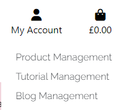

# [The Beauty Box](https://the-beauty-box-9dcfa44a254a.herokuapp.com/)

A fictional E-commerce Beauty Store using Django and Stripe, developed by Natalie Lockyer.

***

[Please click here to view my live website](https://the-beauty-box-9dcfa44a254a.herokuapp.com/)

# Contents
+ [Purpose of the Project](#purpose-of-the-project)
    + [Checkout Details](#checkout-details)
+ [User Experience](#user-experience)
    + [Key Project Goals](#key-project-goals)
    + [Target Audience](#target-audience)
    + [User Requirements and Expectations](#user-requirements-and-expectations)
    + [User Stories](#user-stories)
+ [Website Information](#website-information)
    + [Website Menus](#website-menus)
    + [Wireframes](#wireframes)
      + [Mobile Wireframes](#mobile-wireframes)
      + [Desktop Wireframes](#desktop-wireframes)
    + [Entity Relationship Diagram (ERD)](#entity-relationship-diagrams-erd)
      + [Product ERD](#product-erd)
      + [Checkout ERD](#checkout-erd)
      + [Tutorials ERD](#tutorial-erd)
      + [Blogs ERD](#blog-erd)
      + [Profile ERD](#profile-erd)
      + [Contact ERD](#contact-erd)
    + [Design](#design)
      + [Typography ](#typography)
    + [Features](#features)
      + [Defensive Programming](#defensive-programming)
      + [Main Homepage](#homepage)
      + [Products Page](#products-page)
      + [Product Detail Page](#product-detail-page)
      + [Shopping Basket Page](#shopping-basket-page)
      + [Checkout Page](#checkout-page)
      + [Tutorial Page](#tutorial-page)
      + [Tutorial Detail Page](#tutorial-detail-page)
      + [Blog Page](#blog-page)
      + [Blog Detail Page](#blog-detail-page)
      + [Blog Comment Section](#blog-comment-section)
      + [Sign Up Page](#sign-up-page)
      + [Login Page](#login-page)
      + [Profile Page](#profile-page)
      + [Managment Pages](#management-pages-superusers-only)
      + [Help Page](#help-page)
      + [Contact Page](#contact-page)
      + [404 Error Page](#404-error-page)
    + [Future Features](#future-features)
+ [Technologies Used](#technologies-used)
    + [Languages Used](#languages)
    + [Frameworks Used](#frameworks)
    + [Libraries and Packages](#libraries-and-packages)
    + [Design](#design)
    + [Stripe](#stripe)
+ [Testing](#)
  + [Full Testing](#full-manual-testing)
    + [Responsivity Testing](#responsivity-testing)
    + [Page Testing](#page-testing)
    + [Code Validation](#)
  
    + [Fixed Bugs](#)
+ [Deployment](#deployment)
  + [Creating the Database](#creating-the-database)
  + [Heroku Deployment](#heroku-deployment)
  + [Deployment and Local Deployment](#deployment-and-local-deployment)
  + [How to Clone](#how-to-clone)
+ [Credits and Acknowledgements](#credits-and-acknowledgements)

***
***

# Purpose of the Project
The Beauty Box is a ficticious E-Commerce website that sells beauty products and accessories. The website also has make-up tutorial videos and make-up blogs. 
The website has been designed to give the user a great experience, from an attractive and eyecatching website, to filtering our products to see the newly listed items, tips and tricks in our make-up tutorials and blogs containing up to date and intresting information.  

This full stack frame work has been built using the Django framework. 

The Beauty Box, provides its users with 
* A registration page, which will give the user a profile page once complete. The profile page will allow the user to  update their contact/delivery and payment details and also see their previous orders (if any).
* A product page, detailing all our items we have for sale, which can be filtered into many different categories.
* A checkout page, listing the items in their basket and a secure checkout.
* A tutorial page were users can get the latest tips and tricks and instructions on how to apply their make-up.
* A blog page, again with all the lastest tips and tricks, and the most up to date and interesting information.
* A contact page, where users can get in touch, join our mailing list or ask questions.
* A help page, where users can see our returns policy, delivery costs and our privacy policy.

For Superusers it provides all of the above and in addition -
* A Product management page, where the superuser can add new products directly on the webpage, edit, update and delete products.
* A Tutorial management page, where the superuser can add new tutorials directly on the webpage, edit, update and delete them.
* A Blog management page, where the superuser can add new blogs directly on the webpage, edit, update and delete them.

### Checkout Details

In order to make an example purchase a specific card number is required:
|Card Number|Date|CVC|Postal Code|
|---|---|---|---|
|4242 4242 4242 4242|any future date|any 3 numbers|any 5 numbers|

# User Experience

### Key Project Goals

* To write and develop an E-commerce website that is an eyecatching, informative, interactive, and enjoyable website that users will want to return to.
* The user will be able to navigate around the website with ease, either on a mobile or desktop device. 
* The main homepage is clear as to what the website is about and have accessible menus taking the user to the different pages of the website. 
* Users that register for a Beauty Box account will be able to see their own profile, which will have up to date contact/delivery and payment details. Users will also be able to see their order history (if any). 
* Users will be able to see a products page that lists all the items that Beauty Box has for sale. Users will be able to filter the items into categories of their choosing.
* Users will be able to add products to a basket, go to checkout and pay for the items through a secure checkout.
* Users can view make up tutorials via video and a text column
* Users can view blog posts which provide intereting and up to date information, users can add comments, edit them and delete them. 
* Users can get in touch with our team if required via a contact page.
* Users can see returns policy, delivery information a site policy. 

### Target Audience

* Anyone over the age of 12, that wears or has an interest in make-up.
* Anyone who is looking for gift ideas or want to make a purchase for themselves. 
* Users that want to learn how to apply make up via an online tutorial.
* Users who like to keep up to date with the latest tips and tricks blogs. 

### User Requirements and Expectations 

* An accessable website, that is clear and easy to navigate and understand.
* The ability to register for a Beauty Box account
* The ability to view products, and view them in more detail, before they add them to their basket.
* The ability to filter products into categories.
* The ability to take the products to a checkout and pay for the products securely. 
* The ability to view, add, edit & delete any comments they have made.
* The ability to get in touch.
* The ability to see the return policy, delievery information and the sites privacy policy. 

### User Stories

As a site user:

* I am able to view a list of products
* I am able to view individual products, which contain an image, description, price, shades, quantity and an add to basket button if I wish. 
* I want to be able to identify any products that are in the sale. 
* I want to be able to view the products in my bag, amend them if required, see the total of the products and be able to make a secure payment. 
* I want to be able to register for an account. I want to be able to easily login and out. I am then able to see my personal information, previous orders if any, make changes to my personal information or payment details and view order confirmations. I also want to be able to reset my password if I forget it.
* I want to be able to sort and filter the available products, so that I can quickly identify the best rated and best priced items.
* I want to be able to search for a product by its name.
* I want to be able to add my payment details quickly and be confident that this is a safe and secure process. 
* I want to see confirmation of the products in my basket before purchase and I want an email confirmation once the products have been paid for. 

As a store owner:

* I can add new products, tutorials and blogs to my store
* I can edit and update products/tutorials and blogs. I want to be able to change the product description, prices, images and any other detail that I wish. 
* I can delete products, tutorials and blogs when they are no longer for sale/available to watch. 

# Website Information

### Website Menus
* Homepage
* Index
* Registration/Sign Up Page
* Login Page
* Logout Page
* Products Page
* Basket Page
* Checkout Page
* Tutorials Page
* Blogs Page
* Help Page
* Contact Page
* Privacy Policy Page
* Error Page
* User Profile Page
* Product Management Page (Add/edit and delete Products)
* Tutorial Management Page (Add/edit and delete Tutorials)
* Blog Management Page (Add/edit and delete Products)

### Wireframes

#### Mobile wireframes

#### Desktop wireframes 

### Entity Relationship Diagrams (ERD) 

##### Product ERD

#### Checkout ERD

#### Tutorial ERD

#### Blog ERD

#### Profile ERD

#### Contact ERD

### Design

#### Typography 

For my website I used a font called Raleway. For the main headings and subtitles I used this font in uppercase. For everything else, I used the same font but with a font-weight of 400

### Features

#### Defensive Programming 
Throughout my website I have implemented defensive programming in order to keep it safe.

Within my code, I have used python decorators, specifically 'login_required'. This means that users are not able to access the admin/user profiles, unless they are logged in. It also stops
the users from accessing these pages via their URLs. Users will get error messages if they try to access these parts of the site that they do not have access to. 

I have also used jinga templating. If the user is not logged in they have the option to 'register' or login. If the user is logged in they are able to access their profile page. Jinja also checks if the user is a superuser and block access to admin pagegs if required too.

#### Homepage
* The homepage contains a fully responsive navigation bar used to navigate throughout the site. 
* It displays a profile icon linking to the users profile, or a login menu if the user isnt logged in. 
* A basket icon where the user can see what items (if any) are in the basket. 
* A search bar to find specific items within the site.
* A scrolling banner with messages to the users
* Links to other pages of the website (Shop Now, Tutorials and Beauty Blogs)
* A footer that links the user to social media pages, and in particular our 'Beauty Box' Facebook page.

The Beauty Box Facebook Business Page

#### Products Page
* The products page is fully responsive, altering the layout depending on the size of the device that is used to view it. 
* The navigation bar is also fully reponsive allowing the user to navigate around the store easily
* It displays all the products available within the store
* There is a filtering option that allows users to sort by a specific category, e.g. Price low to high. 
* There is an arrow in the bottom right corner which when pressed takes the user to the top of the page.

#### Product Detail Page
* The product detail page is fully responsive, altering the layout depending on the size of the device that is used to view it. 
* The navigation bar is also fully reponsive allowing the user to navigate around the store easily
* This page shows the individual product, with details about the product
* If the product has shades the user is able to select a colour.
* The user is able to select the quantity of the item
* A keep shopping button that takes the user back to the products page
* Add to basket button which adds the product to the users shopping Basket

#### Shopping Basket Page
* The Shopping Basket page is fully responsive, altering the layout depending on the size of the device that is used to view it. 
* The navigation bar is also fully reponsive allowing the user to navigate around the store easily
* This page shows all the items that the user has added to basket
* This shows an image of the product, the title, the price, the quantity, the subtotal, delivery cost (if applicable) the grand total and the amount the user needs to spend to qualify for free delivery.
* There is also an option for the user to update the quantity or remove the item from the basket.
* A keep shopping button that takes the user back to the products page
* A secure checkout button which takes the user to the secure checkout page
* A homepage button which takes the user back to the homepage
* When a user add an item to the basket / updates the basket or removes the item from the basket the user will get a message.

Example Success Message

#### Checkout Page
* The Checkout Basket page is fully responsive, altering the layout depending on the size of the device that is used to view it. 
* The navigation bar is also fully reponsive allowing the user to navigate around the store easily
* If the user is logged into their account, their email and delivery address will be pre-populated. However, users will still need to enter their full name.
* User can see an order summary containing items within their order, an order total, delivery total and a grand total.
* Once all the form is complete and the user is happy with the order summary, the user is able to input their card details before clicking the complete order button.
* Alternativly they can amend their order using the 'adjust basket' button. 
* When the user selects the complete order button, a confirmation message will appear and the user will recieve a confirmation email.

Confirmation Message

Confirmation Page

Confirmation Email 

#### Tutorial Page
* The Tutorial page is fully responsive, altering the layout depending on the size of the device that is used to view it. 
* The navigation bar is also fully reponsive allowing the user to navigate around the store easily
* It displays all the tutorials available on the site
* There is a homepage button to return the user to the homepage
* You will see on the image that there is an edit|delete button. This is only visible to the superuser which will be covered later.
* When the user clicks on a tutorial image they will be taken to the individual tutorial detail page.

#### Tutorial Detail Page
* The tutorial detail page is fully responsive, altering the layout depending on the size of the device that is used to view it. 
* The navigation bar is also fully reponsive allowing the user to navigate around the store easily
* This page shows the individual tutorial, a tutorial video and a small section of text.
* Users can press the play button to start the video
* The user can see a rating of the video
* There is a return to tutorials button which will take the user back to the tutorial page. 

#### Blog Page
* The blog page is fully responsive, altering the layout depending on the size of the device that is used to view it. 
* The navigation bar is also fully reponsive allowing the user to navigate around the store easily
* It displays all the blogs available on the site
* There is a homepage button to return the user to the homepage
* When the user clicks on the blog image they will be taken to the individual blog detail page.

#### Blog Detail Page
* The blog detail page is fully responsive, altering the layout depending on the size of the device that is used to view it. 
* The navigation bar is also fully reponsive allowing the user to navigate around the store easily
* This page shows the blog image and the content of the blog itself. 
* The user can see a rating of the blog
* There is a return to blog button which will take the user back to the blog page. 
* As the user gets to the bottom of the blog, there is a section where they can add / edit and delete comments.

#### Blog Comment Section
* Logged in users are able to add comments to blogs. 
* They can also make changed to their own comment and delete them if they wish. 
* Comments will only appear on the website once they have been approved by the superuser. 

#### Sign Up Page
* Users can navigate to this page by selecting the Register link on the 'My Account' drop down menu. 
* The sign up page is fully responsive, altering the layout depending on the size of the device that is used to view it. 
* The navigation bar is also fully reponsive allowing the user to navigate around the store easily
* Users are required to input the fields within the form before selecting the 'Sign Up' button. 
* Once done, the user will recieve a message to confirm that a verification email will be sent to them. Users will need to approve this before they get full access to the site. 

Sign Up Verification Message

Sign Up Verification Email

#### Login Page
* Users can navigate to this page by selecting the Login link on the 'My Account' drop down menu. 
* The Login page is fully responsive, altering the layout depending on the size of the device that is used to view it. 
* The navigation bar is also fully reponsive allowing the user to navigate around the store easily
* Users are required to input the fields within the form before selecting the 'Sign In' button. 
* If users forget their password they can select the forgot password link.
* Users also have the option of the 'remember me' button. 

#### Profile Page
* Users can navigate to this page by selecting the My Profile link on the 'My Account' drop down menu. 
* The Profile page is fully responsive, altering the layout depending on the size of the device that is used to view it. 
* The navigation bar is also fully reponsive allowing the user to navigate around the store easily
* On this page, users are able to update their delivery information and contact number. 
* User can also see any previous orders, and click on the link to see them. 

#### Management Pages (Superusers ONLY)
* Superusers can navigate to this page by selecting the relevant management link on the 'My Account' drop down menu. 
* The superusers are able to add / edit and delete products once logged into the site. 
* Superuser are required to fill in the necessary fields before submitting. 
* On this site, the superuser can manage products, tutorials and the blog pages. 

Management Pages for the superuser 

#### Help Page
* Users can navigate to this page by selecting the Help link on the 'My Account' drop down menu. 
* The Help page is fully responsive, altering the layout depending on the size of the device that is used to view it. 
* The navigation bar is also fully reponsive allowing the user to navigate around the store easily
* On this page, users will see information relating to returns, delivery information and the site's privacy policy.
* There is a homepage button to return the user to the homepage
* There is also a link that that the user directly to the contact page.

#### Contact Page
* Users can navigate to this page by selecting the Contact link on the 'My Account' drop down menu. 
* The Contact page is fully responsive, altering the layout depending on the size of the device that is used to view it. 
* The navigation bar is also fully reponsive allowing the user to navigate around the store easily
* On this page, users can enter their name, email address and a message which when submitted will be sent to the admin.
* Users will see a message to confirm that their message was sent. 
* There is a homepage button to return the user to the homepage

Contact Confirmation message

#### 404 Error Page
* Users will be directed to this page if there is a broken link within the website. 
* Users have the option to return to the homepage by selecting the homepage button. 
* Within my code I have also implemented a 'get_object_or_404' function. In the event that a product is not available, does not exist or cannot be found a 404 error is created.

### Future Features

In the future, I would like to add the following features:

* I would like to be able to add the discount codes to the checkout - Unfortuantely I ran out of time and wasnt able to implement it. 
* I would like to add a monthly subscription to a 'Beauty Box'. Users can opt in / opt out monthly if they would like to recieve it. 
* I would like to have a product of the month section - detailing the brand and special offers. 
* I would like to add an image to the 'My Profile' page. 
* I would like to add more products, tutorials and blogs. 
* I would like to add a 'My Favourite Products' Page. Users can add their favourite products to the page and get notifications when the product has been reduced or on offer. 

## Technologies Used

### Languages
* [CSS](https://developer.mozilla.org/en-US/docs/Learn/Getting_started_with_the_web/CSS_basics)
* [HTML](https://developer.mozilla.org/en-US/docs/Web/HTML)
* [JavaScript](https://www.javascript.com/)
* [Markdown](https://www.markdownguide.org/)
* [Python](https://www.python.org/)

### Frameworks
* [Bootstrap](https://getbootstrap.com/) - A framework that uses classes and JS to help build responsive webpages
* [Django](https://www.djangoproject.com/) - A Python web framework that aids in quick development of apps as well as clean design.

### Libraries and Packages

* [boto3](https://pypi.org/project/boto3/) - Allows connection to AWS S3 bucket
* [botocore](https://pypi.org/project/botocore/) - The foundation for the AWS CLI and boto3
* [dj-database-url](https://pypi.org/project/dj-database-url/) - Allows the utilisation of the DATABASE_URL variable
* [Django Allauth](https://docs.allauth.org/en/latest/) - Used for authentication, registration and account management within the site
* [django-countries](https://pypi.org/project/django-countries/) - Provides country choices for use with forms and country field for models
* [django-crispy-forms](https://pypi.org/project/django-crispy-forms/) - Builds programmatic reusable layouts for Django forms
* [django-storages](https://pypi.org/project/django-storages/) - A storage backend library
* [Font Awesome](https://fontawesome.com/) - A library of icons
* [gunicorn](https://pypi.org/project/gunicorn/) - A Python WSGI HTTP Server
* [pillow](https://pypi.org/project/pillow/) - A Python imaging library
* [psycopg2](https://pypi.org/project/psycopg2/) - A postgres database adapter allowing connection with a postgres database
* [jQuery](https://jquery.com/) - V 3.4.1 - A JavaScript framework

### Design

* [Google Fonts](https://fonts.google.com/) - a free, open-source collection of web fonts provided by Google 
* [Git](https://git-scm.com/) - Version control
* [GitHub](https://github.com/) - Saves and stores files for the project
* [Google Dev Tools](https://developer.chrome.com/docs/devtools/) - Helps diagnose problems quickly and test features
* [pip](https://pypi.org/project/pip/) - Used for installing/unistalling packages in the terminal

### Stripe
* [Stripe](https://stripe.com/gb) is used to implement the payment system.

In order to make a successful example purchase a specific card number is required:
|Card Number|Date|CVC|Postal Code|
|---|---|---|---|
|4242 4242 4242 4242|any future date|any 3 numbers|any 5 numbers|

In order to make a payment that requires authentication a specific care number is required:
|Card Number|Date|CVC|Postal Code|
|---|---|---|---|
|4000 0025 0000 3155|any date|any 3 numbers|any 5 numbers|

In order to make a payment always Declines (e.g. insufficent funds):
|Card Number|Date|CVC|Postal Code|
|---|---|---|---|
|4000 0000 0000 9995|any date|any 3 numbers|any 5 numbers|

# Testing
Throughout the development of my website I used both automated and manual testing.
I completed manual testing by checking each page to ensure all the features worked as expected and in line with the user stories. 
I completed automated testing by running my code through validators and linters in order to check for errors in the code and to ensure there are no pep8 compliance issues. 

### Full Manual Testing

#### Responsivity Testing
|Responsivity | Mobile S (320px)| Mobile L (425px)| Tablet (768px) | Desktop (1024px)|
|---|:---:|:---:|:---:|:---:|
|Responsive UI Components|✓|✓|✓|✓|
|Responsive Text|✓|✓|✓|✓|
|Responsive Forms|✓|✓|✓|✓|
|Responsive Button Placement|✓|✓|✓|✓|
|Responsive Nav Bar|✓|✓|✓|✓|
|Responsive Footer|✓|✓|✓|✓|

#### Page Testing 
|Homepage Testing|Yes/No|
|---|:---:|
|Nav bar text and styles are loaded|✓|
|The Beauty Box title returns to homepage|✓|
|The search bar returns relevent items|✓|
|My account opens dropdown list|✓|
|Register opens registration page|✓|
|Login opens login page|✓|
|Product Management opens P/M page|✓|
|Tutorial Management opens to T/M page|✓|
|Blog Management opens B/M page|✓|
|My Profile opens M/P page|✓|
|Contact opens C/P|✓|
|Help opens H/P|✓|
|Home returns to home page|✓|
|Shopping basket opens basket page|✓|
|All list items (foundation, eyes etc) take the user to the relevent page|✓|
|Banner scrolls across the screen|✓|
|Shop Now button opens product page|✓|
|Tutorials opens tutorials page|✓|
|Beauty Blog opens blog page|✓|
|Social media links open relevent page|✓|
|Modal appears on loading asking new users to subscribe|✓|
|All items on homepage are responsive|✓|

|Products Testing|Yes/No|
|---|:---:|
|Nav bar text and styles are loaded|✓|
|Homepage button returns to homepage|✓|
|Sort by filter arranges products in specific order|✓|
|Selecting product opens product detail|✓|
|Quantity updates when changed|✓|
|Keep shopping button returns to products|✓|
|Add to basket, adds the item to the basket|✓|
|Basket total is updated|✓|

|Basket Testing|Yes/No|
|---|:---:|
|Nav bar text and styles are loaded|✓|
|Success message when adding item to basket|✓|
|Homepage buttons returns to homepage|✓|
|User can see, product info, price, quantity and subtotal|✓|
|Each is updated when appropriate|✓|
|Quantity + button increases quantity|✓|
|Quantity - button decreases quantity|✓|
|Update button updates quantity|✓|
|Remove button updates quantity|✓|
|User can see, basket total, delivery charges (if any), grand total, and how much extra to spend to get free delivery|✓|
|Keep shopping button returns useer to products page|✓|
|Secure checkout opens secure checkout|✓|

|Secure Checkout Testing|Yes/No|
|---|:---:|
|Nav bar text and styles are loaded|✓|
|Homepage buttons returns to homepage|✓|
|Detail for works as expected|✓|
|Detail for is pre-populated if user is logged in|✓|
|Order summary is correct including products and total/delivery/grand total|✓|
|Create an account button opens registration page|✓|
|Login button opens login page|✓|
|Payment details can be entered|✓|
|Adjust basket button opens the basket page|✓|
|Complete Order button completes the order|✓|
|Success messages appears to confirm order|✓|
|Order confirmation details appear on the screen|✓|
|Confirmation email is sent to user|✓|

|Tutorial Testing|Yes/No|
|---|:---:|
|Nav bar text and styles are loaded|✓|
|Homepage buttons returns to homepage|✓|
|4 tutorials appear on the page|✓|
|Clicked on each image and it loads to the tutorial detail page|✓|
|The video is displayed but does not play automatically|✓|
|User clicks the play button and the video starts|✓|
|Return to tutorials button returns to tutorial page|✓|

|Blog Testing|Yes/No|
|---|:---:|
|Nav bar text and styles are loaded|✓|
|Homepage buttons returns to homepage|✓|
|4 blogs appear on the page|✓|
|Clicked on each image and it loads to the blog detail page|✓|
|Logged in users are able to add a comment|✓|
|Logged in users are able to edit their comment|✓|
|Logged in users are able to delete their comment|✓|
|Comments are displayed to others when the admin has approved them|✓|
|All users are able to see authorised comments|✓|
|Return to blogs button returns to blog page|✓|

|Sign Up/Registration Testing|Yes/No|
|---|:---:|
|Nav bar text and styles are loaded|✓|
|Aready have an account sign in button takes to login page|✓|
**Enter details and select sign up -**
|Success message appears|✓|
|User recieves a verification email|✓|
|User activates the verification link and taken to login page|✓|
|User confirms email on the page|✓|
|User then has access to their account|✓|

|SignIn/Login Testing|Yes/No|
|---|:---:|
|Nav bar text and styles are loaded|✓|
|Not yet created an account, signup button goes to signup page|✓|
**Enter details and select sign in -**
|Remember me button remembers me|✓|
|Successful login message appears|✓|
|Forget Password - resets password|✓|

|Logout Testing|Yes/No|
|---|:---:|
|Nav bar text and styles are loaded|✓|
|Sign out button signs the user out of their account|✓|

|Help Page Testing|Yes/No|
|---|:---:|
|Nav bar text and styles are loaded|✓|
|Homepage buttons returns to homepage|✓|
|Contact page button opens contact page|✓|
|Privacy policy link opens our websites privacy policy|✓|

|Contact Page Testing|Yes/No|
|---|:---:|
|Nav bar text and styles are loaded|✓|
|Homepage buttons returns to homepage|✓|
|User is able to input details and click submit|✓|
|Success message appears|✓|

|My Profile Testing|Yes/No|
|---|:---:|
|Nav bar text and styles are loaded|✓|
|Homepage buttons returns to homepage|✓|
|User is able to update delivery information|✓|
|User is able to see previous orders (if any)|✓|

|Product Management Testing|Yes/No|
|---|:---:|
**Superuser Only**
|Nav bar text and styles are loaded|✓|
|Superuser is able to input details on required fields|✓|
|Superuser is able to 'select and add image'|✓|
|Superuser clicks add product and product is added to site|✓|

|Tutorial Management Testing|Yes/No|
|---|:---:|
**Superuser Only**
|Nav bar text and styles are loaded|✓|
|Superuser is able to input details on required fields|✓|
|Superuser is able to 'select and add image and video'|✓|
|Superuser clicks add tutorial and tutorial is added to site|✓|

|Blog Management Testing|Yes/No|
|---|:---:|
**Superuser Only**
|Nav bar text and styles are loaded|✓|
|Superuser is able to input details on required fields|✓|
|Superuser is able to 'select and add image'|✓|
|Superuser clicks add blog and blog is added to site|✓|

|Admin Testing|Yes/No|
|---|:---:|
**Superuser Only**
**AUTHENTICATION AND AUTHORIZATION**
|Superuser user is able to see users who have register for an account|✓|
|Superuser is able to add personal information if needed|✓|
|Superuser is able to add permissions to users|✓|
**BLOGS**
|Superuser is able to add/edit/delete blogs|✓|
|Superuser is able to see users comments|✓|
|Superuser is able to authorise comments|✓|
|Superuser is able to delete comments|✓|
**CHECKOUT**
|Superuser is able to see orders|✓|
|Superuser is able to edit orders|✓|
|Superuser is able to delete orders|✓|
**CONTACT**
|Superuser is able to see collaboration request|✓|
|Superuser is able to mark the request as read|✓|
|Superuser is able to delete the request|✓|
**PRODUCTS**
|Superuser is able to add categories|✓|
|Superuser is able to edit categories|✓|
|Superuser is able to delete categories|✓|
|Superuser is able to add products|✓|
|Superuser is able to edit products|✓|
|Superuser is able to delete products|✓|
**TUTORIALS**
|Superuser is able to add tutorials|✓|
|Superuser is able to edit tutorials|✓|
|Superuser is able to delete tutorials|✓|
**MAILCHIMP**
|Superuser is able to login to MailChimp as see users who have subscribed|✓|

### Code Validation

I opted to use PageSpeed Insights instead of the browser devtool version of Lighthouse. PageSpeed uses the Lighthouse API in order to test webpages.

#### Homepage

#### Signup 

#### Login

#### Product page

#### Tutorials

#### Blogs

#### Product Management

#### Tutorial Management 

#### Blog Management

#### Help Page

#### Contact Page 

#### My Profile

### Fixed Bugs

# Deployment

## Creating the Database
To create the database I used ElephantSQL for this project. During development I was using sqlite3 however this isn't usable within deployment

## Heroku Deployment
To deploy this site on Heroku the following steps were performed:

After the initial account setup
* Click the "create new app" button on heroku
* Create a unique name for the app
* Select region (Europe was selected for this project)
* Click "create app"
* Go to settings tab
* Set config variables
- EG - AWS_ACCESS_KEY_ID (this connects ta AWS S3 Bucket)
     - AWS_SECRET_ACCESS_KEY (this connects ta AWS S3 Bucket)
     - DATABASE_URL (Connects to Database)
     - SECRET_KEY (Connects to app)
* Go to the deploy tab
* Select the deployment method (github was used for this project)
* Search for the github repository name
* Then click on Connect
* There is an option to use manual deployment or automatic deployment. Make sure main branch is selected
* After the first deployment you will see a message saying "your app was successfully deployed" and there will be a "view" button to take you to your deployed application

## Deployment and Local Deployment
All code was written within GitPod development environment. 
I used GitHub for version control and was finally deployed to Heroku from GitHub.
  How to Fork 
  * Login to Github
  * Open repository
  * Click fork button in the top right corner.

## How to clone 
  * Login to Github
  * Open repository 
  * Click on the 'code' button, select which you would like with HTTPS, SSH or GitHib CLI and copy
  * Open terminal in code editor and change the current directory to the location you want to use is
  * Type 'git clone' and paste link that you copied in step 3, press enter

## Credits and Acknowledgements
* [Django](https://www.djangoproject.com/) - Used this the create my site
* [Code Institute](https://learn.codeinstitute.net/dashboard) - Used the walkthrough alongside implementing my project
* [Code Institute Python Linter](https://pep8ci.herokuapp.com/) - Used to check and fix python errors
* [ChatGPT 4](https://chat.openai.com/) - Used to find possible solutions to major issues, and to populate the content for the blogs and tutorials.
* [Google Fonts](https://fonts.google.com/) - Used for fonts across my site
* [Heroku](https://www.heroku.com/home) - Used to deploy the site too.
* [Python](https://www.python.org/) - Used for coding functions and classes
* [Pexels](https://www.pexels.com/) - Used for selecting images for my website
* [Coverr](https://coverr.co/) - Used for selecting videos for my website
* [Kaggle](https://www.kaggle.com/) - Used to get database content for products
* [MailChimp](https://mailchimp.com/) - Used for newletter subscription pop up 
* [Slack](https://app.slack.com/) - Used for trouble shooting with colleagues

A special thank you to Gemma Sayers who came to my rescue in my hour of need. And a huge thank you to my family, who have supported me throughout this whole course.